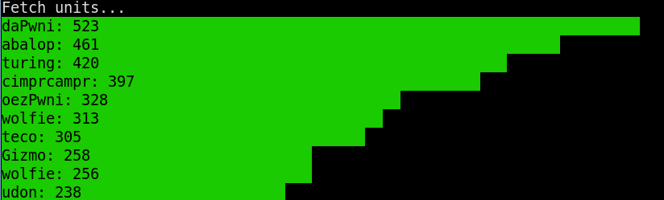

# usage
```bash
# top units sorted by captured networks
./rank.py --max 10 --key networks

# top units sorted by epochs
./rank.py --max 10 --key data_epochs

# top units sorted by deauths
./rank.py --max 10 --key data_deauthed
```

## example
`./rank.py --max 10 --key networks`


